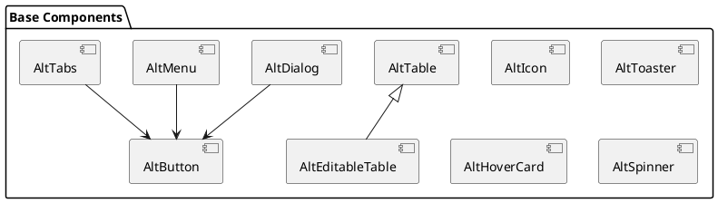

# Базовые компоненты

Базовые компоненты представляют собой фундаментальные элементы интерфейса, которые используются как строительные блоки для создания более сложных компонентов и интерфейсов.

## AltButton

### Описание
Компонент кнопки с поддержкой различных вариантов отображения, состояний и возможностью интеграции с Vue Router.

### Props

| Название | Тип | По умолчанию | Обязательный | Описание |
|----------|-----|--------------|--------------|----------|
| to | String, Object | "" | Нет | Vue Router путь. Если указан, кнопка работает как `<router-link>` |
| loading | Boolean | false | Нет | Показывает индикатор загрузки внутри кнопки |
| disabled | Boolean | false | Нет | Отключает кнопку |

### События

| Название | Полезная нагрузка | Описание |
|----------|-------------------|----------|
| click | MouseEvent | Срабатывает при клике на кнопку, если не указан параметр `to` |

### Слоты

| Название | Данные скопа | Описание |
|----------|--------------|----------|
| default | - | Основное содержимое кнопки |

### Пример использования

```vue
<template>
  <AltButton @click="handleClick" :disabled="isDisabled" :loading="isLoading">
    Нажми меня
  </AltButton>
  
  <AltButton to="/dashboard">
    Перейти в панель управления
  </AltButton>
</template>

<script setup>
import { AltButton } from "alt-ui";
import { ref } from 'vue';

const isDisabled = ref(false);
const isLoading = ref(false);

function handleClick() {
  isLoading.value = true;
  // Логика обработки клика
  setTimeout(() => {
    isLoading.value = false;
  }, 1000);
}
</script>
```

### Стилизация
Компонент использует CSS переменные для настройки внешнего вида:
- `--alt-font-size-1` - размер шрифта
- `--alt-c-text-3` - цвет текста
- `--alt-space-3`, `--alt-space-6` - внутренние отступы
- `--alt-c-surface-2` - цвет фона
- `--alt-c-brand-1-200` - цвет рамки

## AltIcon

### Описание
Компонент для отображения SVG иконок с поддержкой кастомизации размера и цвета.

### Props

| Название | Тип | По умолчанию | Обязательный | Описание |
|----------|-----|--------------|--------------|----------|
| name | String | - | Да | Название иконки |
| size | Number, String | 24 | Нет | Размер иконки в пикселях |
| color | String | "currentColor" | Нет | Цвет иконки (CSS цвет) |

### Пример использования

```vue
<template>
  <AltIcon name="check" size="16" color="#4CAF50" />
  <AltIcon name="close" :size="24" />
</template>

<script setup>
import { AltIcon } from "alt-ui";
</script>
```

## AltDialog

### Описание
Модальный диалог с настраиваемым содержимым, заголовком и действиями.

### Props

| Название | Тип | По умолчанию | Обязательный | Описание |
|----------|-----|--------------|--------------|----------|
| modelValue | Boolean | false | Нет | Контролирует видимость диалога |
| title | String | "" | Нет | Заголовок диалога |
| closeOnEsc | Boolean | true | Нет | Закрывать ли диалог при нажатии ESC |
| closeOnOutsideClick | Boolean | true | Нет | Закрывать ли диалог при клике вне его |

### События

| Название | Полезная нагрузка | Описание |
|----------|-------------------|----------|
| update:modelValue | Boolean | Срабатывает при изменении видимости диалога |
| close | - | Срабатывает при закрытии диалога |

### Слоты

| Название | Данные скопа | Описание |
|----------|--------------|----------|
| default | - | Основное содержимое диалога |
| title | - | Содержимое заголовка (если нужна кастомизация) |
| footer | - | Нижняя часть диалога (кнопки действий) |

### Пример использования

```vue
<template>
  <AltButton @click="showDialog = true">
    Открыть диалог
  </AltButton>
  
  <AltDialog v-model="showDialog" title="Подтверждение">
    <p>Вы уверены, что хотите продолжить?</p>
    
    <template #footer>
      <AltButton @click="showDialog = false">Отмена</AltButton>
      <AltButton @click="confirm">Подтвердить</AltButton>
    </template>
  </AltDialog>
</template>

<script setup>
import { ref } from 'vue';
import { AltDialog, AltButton } from 'alt-ui';

const showDialog = ref(false);

function confirm() {
  // Логика подтверждения
  showDialog.value = false;
}
</script>
```

## AltTable

### Описание
Компонент таблицы с поддержкой кастомизации ячеек, сортировки и других функций.

### Props

| Название | Тип | По умолчанию | Обязательный | Описание |
|----------|-----|--------------|--------------|----------|
| columns | Array | [] | Да | Массив конфигураций колонок |
| data | Array | [] | Да | Массив данных для отображения |
| loading | Boolean | false | Нет | Показывает состояние загрузки |

### Слоты

| Название | Данные скопа | Описание |
|----------|--------------|----------|
| header-\{column.key\} | \{ column \} | Кастомный заголовок для колонки |
| cell-\{column.key\} | \{ row, column, index \} | Кастомная ячейка для колонки |
| empty | - | Содержимое при отсутствии данных |

### Пример использования

```vue
<template>
  <AltTable :columns="columns" :data="users" :loading="loading">
    <template #cell-actions="{ row }">
      <AltButton @click="editUser(row)">Редактировать</AltButton>
    </template>
  </AltTable>
</template>

<script setup>
import { ref } from 'vue';
import { AltTable, AltButton } from 'alt-ui';

const loading = ref(false);
const columns = [
  { key: 'id', title: 'ID' },
  { key: 'name', title: 'Имя' },
  { key: 'email', title: 'Email' },
  { key: 'actions', title: 'Действия' }
];

const users = ref([
  { id: 1, name: 'Иван Иванов', email: 'ivan@example.com' },
  { id: 2, name: 'Петр Петров', email: 'petr@example.com' }
]);

function editUser(user) {
  // Логика редактирования пользователя
}
</script>
```

## Диаграмма наследования компонентов



## Лучшие практики

1. **Композиция компонентов**

```vue
<AltButton>
  <AltIcon name="save" />
  Сохранить
</AltButton>
```

2. **Обработка состояний**

```vue
<AltButton 
  :loading="isLoading"
  :disabled="!isValid"
  @click="handleClick"
>
  Отправить
</AltButton>
```

3. **Использование слотов**

```vue
<AltDialog>
  <template #title>
    Пользовательский заголовок
  </template>
  <template #content>
    Пользовательский контент
  </template>
</AltDialog>
```

## Рекомендации по использованию

1. Всегда используйте базовые компоненты вместо HTML-элементов
2. Соблюдайте консистентность в использовании пропсов
3. Используйте TypeScript для лучшей типизации
4. Следите за производительностью при использовании сложных компонентов 