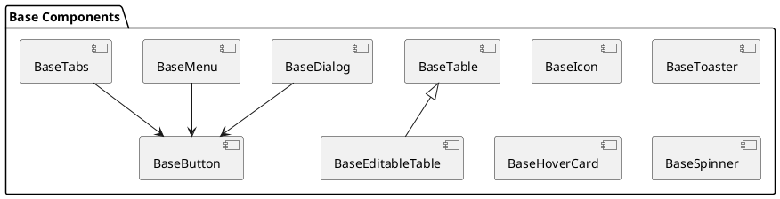

# Базовые компоненты

Базовые компоненты являются фундаментальными строительными блоками интерфейса Lissa Health. Они разработаны с учетом принципов переиспользуемости, доступности и производительности.

## Компоненты

### BaseButton

Основной компонент для создания кнопок различных типов и состояний.

```vue
<BaseButton variant="primary" size="md" :loading="false">
  Нажми меня
</BaseButton>
```

#### API

| Prop | Тип | По умолчанию | Описание |
|------|-----|--------------|-----------|
| variant | 'primary' \| 'secondary' \| 'ghost' | 'primary' | Вариант отображения |
| size | 'sm' \| 'md' \| 'lg' | 'md' | Размер кнопки |
| loading | boolean | false | Состояние загрузки |
| disabled | boolean | false | Отключение кнопки |

### BaseIcon

Компонент для отображения векторных иконок.

```vue
<BaseIcon name="check" size="md" />
```

#### API

| Prop | Тип | По умолчанию | Описание |
|------|-----|--------------|-----------|
| name | string | - | Название иконки |
| size | 'sm' \| 'md' \| 'lg' | 'md' | Размер иконки |
| color | string | 'currentColor' | Цвет иконки |

### BaseDialog

Модальное окно для отображения важной информации или форм.

```vue
<BaseDialog v-model="isOpen" title="Заголовок">
  <template #content>
    Содержимое диалога
  </template>
  <template #footer>
    <BaseButton @click="close">Закрыть</BaseButton>
  </template>
</BaseDialog>
```

#### API

| Prop | Тип | По умолчанию | Описание |
|------|-----|--------------|-----------|
| modelValue | boolean | false | Управление видимостью |
| title | string | - | Заголовок диалога |
| closeable | boolean | true | Возможность закрытия |

### BaseTable

Компонент для отображения табличных данных с поддержкой сортировки и фильтрации.

```vue
<BaseTable 
  :columns="columns"
  :data="tableData"
  :sortable="true"
/>
```

#### API

| Prop | Тип | По умолчанию | Описание |
|------|-----|--------------|-----------|
| columns | Column[] | [] | Конфигурация колонок |
| data | any[] | [] | Данные таблицы |
| sortable | boolean | false | Возможность сортировки |

### BaseEditableTable

Расширенная версия таблицы с возможностью редактирования данных.

```vue
<BaseEditableTable 
  v-model="tableData"
  :columns="columns"
  @update:row="handleRowUpdate"
/>
```

### BaseToaster

Компонент для отображения уведомлений.

```vue
<BaseToaster 
  type="success"
  title="Успех"
  message="Операция выполнена успешно"
/>
```

### BaseMenu

Выпадающее меню с поддержкой вложенных элементов.

```vue
<BaseMenu>
  <BaseButton slot="trigger">Меню</BaseButton>
  <BaseMenuItem>Пункт 1</BaseMenuItem>
  <BaseMenuItem>Пункт 2</BaseMenuItem>
</BaseMenu>
```

### BaseTabs

Компонент для организации контента по вкладкам.

```vue
<BaseTabs v-model="activeTab">
  <BaseTabsTrigger value="tab1">Вкладка 1</BaseTabsTrigger>
  <BaseTabsTrigger value="tab2">Вкладка 2</BaseTabsTrigger>
</BaseTabs>
```

### BaseHoverCard

Всплывающая карточка при наведении.

```vue
<BaseHoverCard>
  <template #trigger>
    <span>Наведите курсор</span>
  </template>
  <template #content>
    Дополнительная информация
  </template>
</BaseHoverCard>
```

### BaseSpinner

Индикатор загрузки.

```vue
<BaseSpinner size="md" />
```

## Диаграмма наследования компонентов



## Лучшие практики

1. **Композиция компонентов**
   ```vue
   <BaseButton>
     <BaseIcon name="save" />
     Сохранить
   </BaseButton>
   ```

2. **Обработка состояний**
   ```vue
   <BaseButton 
     :loading="isLoading"
     :disabled="!isValid"
     @click="handleClick"
   >
     Отправить
   </BaseButton>
   ```

3. **Использование слотов**
   ```vue
   <BaseDialog>
     <template #title>
       Пользовательский заголовок
     </template>
     <template #content>
       Пользовательский контент
     </template>
   </BaseDialog>
   ```

## Рекомендации по использованию

1. Всегда используйте базовые компоненты вместо HTML-элементов
2. Соблюдайте консистентность в использовании пропсов
3. Используйте TypeScript для лучшей типизации
4. Следите за производительностью при использовании сложных компонентов 