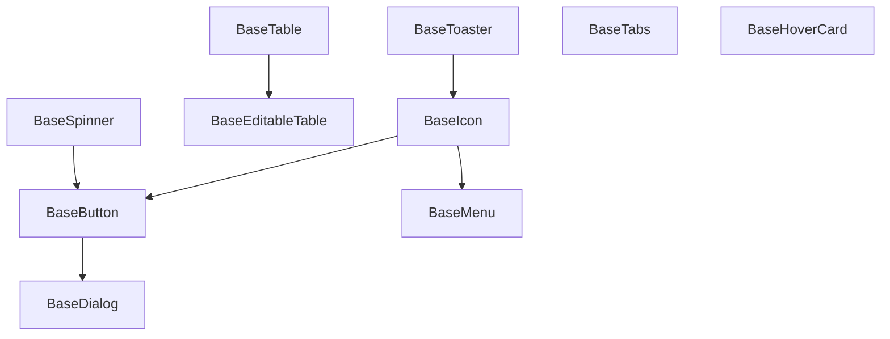

# Базовые компоненты

Базовые компоненты Alt-UI являются строительными блоками для создания пользовательских интерфейсов. Они разработаны с учетом принципов переиспользуемости, доступности и производительности.

## Компоненты

### BaseButton

Универсальный компонент кнопки с различными вариантами отображения и состояниями.

```vue
<BaseButton variant="primary" size="md" :loading="false">
  Нажми меня
</BaseButton>
```

#### API

| Prop | Тип | По умолчанию | Описание |
|------|-----|--------------|-----------|
| variant | 'primary' \| 'secondary' \| 'ghost' \| 'danger' \| 'small' | 'primary' | Вариант отображения |
| size | 'sm' \| 'md' \| 'lg' | 'md' | Размер кнопки |
| loading | boolean | false | Состояние загрузки |
| disabled | boolean | false | Отключение кнопки |

### BaseIcon

Компонент для отображения векторных иконок из предопределенного набора или пользовательских SVG.

```vue
<BaseIcon name="check" size="24" color="currentColor" />
```

#### API

| Prop | Тип | По умолчанию | Описание |
|------|-----|--------------|-----------|
| name | string | - | Название иконки |
| size | string \| number | '24' | Размер иконки (пиксели) |
| color | string | 'currentColor' | Цвет иконки |

### BaseDialog

Модальное окно с настраиваемым содержимым.

```vue
<script setup>
import { ref } from 'vue';
import { BaseDialog, BaseButton } from 'alt-ui';

const dialog = ref(null);

function openDialog() {
  dialog.value.show();
}

function closeDialog() {
  dialog.value.close();
}
</script>

<template>
  <BaseButton @click="openDialog">Открыть диалог</BaseButton>
  
  <BaseDialog ref="dialog">
    <div class="dialog-content">
      <h2>Заголовок</h2>
      <p>Содержимое диалога</p>
      <div class="dialog-footer">
        <BaseButton @click="closeDialog">Закрыть</BaseButton>
      </div>
    </div>
  </BaseDialog>
</template>
```

#### API

| Метод | Описание |
|------|-----------|
| show() | Открывает диалог |
| close() | Закрывает диалог |

### BaseTable

Компонент для отображения табличных данных с поддержкой сортировки.

```vue
<BaseTable 
  :headers="headers"
  :rows="tableData"
/>
```

#### API

| Prop | Тип | По умолчанию | Описание |
|------|-----|--------------|-----------|
| headers | TableHeader[] | [] | Конфигурация заголовков |
| rows | TableRow[] | [] | Данные таблицы |

#### TableHeader

| Свойство | Тип | Описание |
|----------|-----|-----------|
| key | string | Ключ колонки |
| text | string | Текст заголовка |
| sortable | boolean | Возможность сортировки |
| class | string | CSS класс |

### BaseEditableTable

Таблица с возможностью редактирования ячеек.

```vue
<BaseEditableTable 
  v-model="tableData"
  :headers="headers"
  :editable="true"
/>
```

#### API

Включает те же пропсы, что и BaseTable, плюс:

| Prop | Тип | По умолчанию | Описание |
|------|-----|--------------|-----------|
| editable | boolean | false | Режим редактирования |
| addButtonText | string | 'Add Row' | Текст кнопки добавления |

### BaseSpinner

Индикатор загрузки.

```vue
<BaseSpinner size="24" color="currentColor" />
```

#### API

| Prop | Тип | По умолчанию | Описание |
|------|-----|--------------|-----------|
| size | string \| number | '24' | Размер спиннера |
| color | string | 'currentColor' | Цвет спиннера |

### BaseTabs

Компонент для организации контента по вкладкам.

```vue
<BaseTabs v-model="activeTab">
  <template #tabs>
    <div class="tab" :class="{ active: activeTab === 'tab1' }" @click="activeTab = 'tab1'">Вкладка 1</div>
    <div class="tab" :class="{ active: activeTab === 'tab2' }" @click="activeTab = 'tab2'">Вкладка 2</div>
  </template>
  
  <div v-if="activeTab === 'tab1'">Содержимое вкладки 1</div>
  <div v-if="activeTab === 'tab2'">Содержимое вкладки 2</div>
</BaseTabs>
```

#### API

| Prop | Тип | По умолчанию | Описание |
|------|-----|--------------|-----------|
| modelValue | string | - | Активная вкладка |

### BaseHoverCard

Всплывающая карточка при наведении.

```vue
<BaseHoverCard>
  <template #trigger>
    <span>Наведите курсор</span>
  </template>
  <template #content>
    <div class="hover-card-content">
      Дополнительная информация
    </div>
  </template>
</BaseHoverCard>
```

### BaseMenu

Выпадающее меню.

```vue
<BaseMenu :items="menuItems" label-key="label" value-key="value">
  <template #trigger>
    <BaseButton>Открыть меню</BaseButton>
  </template>
  <template #item="{ item }">
    {{ item.label }}
  </template>
</BaseMenu>
```

#### API

| Prop | Тип | По умолчанию | Описание |
|------|-----|--------------|-----------|
| items | MenuItem[] | [] | Элементы меню |
| labelKey | string | 'label' | Ключ для отображения |
| valueKey | string | 'value' | Ключ для значения |
| showTriggerIndicator | boolean | false | Показывать индикатор |

### BaseToaster

Система уведомлений.

```vue
<script setup>
import { toast } from 'alt-ui';

function showToast() {
  toast.success('Операция выполнена успешно');
}
</script>

<template>
  <BaseButton @click="showToast">Показать уведомление</BaseButton>
</template>
```

#### API (toast)

| Метод | Параметры | Описание |
|-------|-----------|-----------|
| success | (description, title?) | Успешное уведомление |
| error | (description, title?) | Ошибка |
| info | (description, title?) | Информация |
| warning | (description, title?) | Предупреждение |
| loading | (description, title?) | Загрузка |
| dismiss | (id) | Закрыть уведомление |

### BaseSegmentGroup

Группа сегментов для выбора опций.

```vue
<BaseSegmentGroup v-model="selectedOption" :options="options" />
```

### BaseCarousel

Карусель для отображения контента.

```vue
<BaseCarousel :items="carouselItems">
  <template #item="{ item }">
    <div class="carousel-slide">
      {{ item.content }}
    </div>
  </template>
</BaseCarousel>
```

### BaseCollapsableHint

Сворачиваемая подсказка/информация.

```vue
<BaseCollapsableHint title="Подробнее">
  Дополнительная информация, которая будет скрыта до клика
</BaseCollapsableHint>
```

## Взаимосвязи компонентов



## Лучшие практики

1. **Композиция компонентов**
   ```vue
   <BaseButton>
     <BaseIcon name="save" />
     Сохранить
   </BaseButton>
   ```

2. **Обработка состояний**
   ```vue
   <BaseButton 
     :loading="isLoading"
     :disabled="!isValid"
     @click="handleSubmit"
   >
     Отправить
   </BaseButton>
   ```

3. **Использование слотов**
   ```vue
   <BaseDialog ref="dialog">
     <div class="custom-dialog">
       <h2>Пользовательский заголовок</h2>
       <div class="content">
         Пользовательский контент
       </div>
       <div class="actions">
         <BaseButton @click="dialog.close()">Закрыть</BaseButton>
       </div>
     </div>
   </BaseDialog>
   ```

4. **Работа с событиями**
   ```vue
   <BaseMenu 
     :items="menuItems"
     @select="handleSelect"
   />
   ```

## Рекомендации по использованию

1. Предпочитайте базовые компоненты Alt-UI вместо стандартных HTML-элементов для консистентности
2. Используйте TypeScript для полной типизации пропсов и событий
3. Комбинируйте базовые компоненты для создания сложных интерфейсов
4. Придерживайтесь единого стиля использования компонентов во всем проекте 