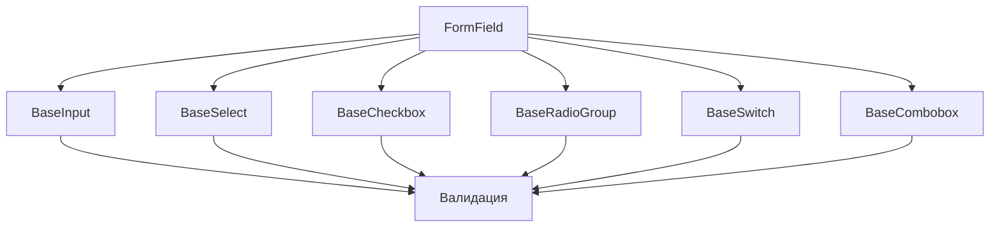

# Компоненты форм

Компоненты форм представляют собой специализированные элементы интерфейса для работы с пользовательским вводом. Все компоненты поддерживают валидацию, состояния ошибок и интеграцию с Vue форм-менеджерами.

## Архитектура форм



<!-- id="form-components" caption="Архитектура форм" -->

## Компоненты

### FormField

Базовый компонент-обертка для всех элементов форм.

```vue
<FormField
  label="Имя пользователя"
  :error="errors.username"
  required
>
  <BaseInput v-model="username" />
</FormField>
```

#### API

| Prop | Тип | По умолчанию | Описание |
|------|-----|--------------|-----------|
| label | string | - | Метка поля |
| error | string | - | Текст ошибки |
| required | boolean | false | Обязательное поле |

### BaseInput

Текстовое поле ввода с поддержкой различных типов.

```vue
<BaseInput
  v-model="value"
  type="text"
  placeholder="Введите текст"
  :error="error"
/>
```

#### API

| Prop | Тип | По умолчанию | Описание |
|------|-----|--------------|-----------|
| modelValue | string | '' | Значение поля |
| type | 'text' \| 'password' \| 'email' \| 'number' | 'text' | Тип поля |
| placeholder | string | - | Подсказка |
| error | string | - | Текст ошибки |

### BaseSelect

Выпадающий список с поддержкой поиска.

```vue
<BaseSelect
  v-model="selected"
  :options="options"
  placeholder="Выберите опцию"
/>
```

#### API

| Prop | Тип | По умолчанию | Описание |
|------|-----|--------------|-----------|
| modelValue | any | null | Выбранное значение |
| options | Option[] | [] | Массив опций |
| searchable | boolean | false | Возможность поиска |

### BaseCheckbox

Чекбокс с поддержкой промежуточного состояния.

```vue
<BaseCheckbox
  v-model="checked"
  label="Согласен с условиями"
/>
```

#### API

| Prop | Тип | По умолчанию | Описание |
|------|-----|--------------|-----------|
| modelValue | boolean | false | Состояние |
| label | string | - | Текст метки |
| indeterminate | boolean | false | Промежуточное состояние |

### BaseRadioGroup

Группа радио-кнопок.

```vue
<BaseRadioGroup
  v-model="selected"
  :options="options"
  orientation="horizontal"
/>
```

#### API

| Prop | Тип | По умолчанию | Описание |
|------|-----|--------------|-----------|
| modelValue | any | null | Выбранное значение |
| options | Option[] | [] | Массив опций |
| orientation | 'horizontal' \| 'vertical' | 'vertical' | Ориентация |

### BaseSwitch

Переключатель.

```vue
<BaseSwitch
  v-model="enabled"
  label="Включить уведомления"
/>
```

#### API

| Prop | Тип | По умолчанию | Описание |
|------|-----|--------------|-----------|
| modelValue | boolean | false | Состояние |
| label | string | - | Текст метки |
| size | 'sm' \| 'md' \| 'lg' | 'md' | Размер |

### BaseCombobox

Комбинированное поле ввода с выпадающим списком и поддержкой автодополнения.

```vue
<BaseCombobox
  v-model="value"
  :options="options"
  :loading="isLoading"
  @search="handleSearch"
/>
```

#### API

| Prop | Тип | По умолчанию | Описание |
|------|-----|--------------|-----------|
| modelValue | any | null | Выбранное значение |
| options | Option[] | [] | Массив опций |
| loading | boolean | false | Состояние загрузки |
| multiple | boolean | false | Множественный выбор |

## Интеграция с форм-менеджерами

### Пример с VeeValidate

```vue
<script setup lang="ts">
import { useForm } from 'vee-validate'

const { handleSubmit, errors } = useForm({
  validationSchema: {
    username: 'required|min:3',
    email: 'required|email'
  }
})
</script>

<template>
  <form @submit="handleSubmit">
    <FormField
      label="Имя пользователя"
      :error="errors.username"
      required
    >
      <BaseInput
        v-model="username"
        name="username"
      />
    </FormField>
    
    <FormField
      label="Email"
      :error="errors.email"
      required
    >
      <BaseInput
        v-model="email"
        type="email"
        name="email"
      />
    </FormField>
  </form>
</template>
```

## Лучшие практики

1. **Группировка полей**
   ```vue
   <div class="form-group">
     <FormField>
       <BaseInput v-model="firstName" label="Имя" />
     </FormField>
     <FormField>
       <BaseInput v-model="lastName" label="Фамилия" />
     </FormField>
   </div>
   ```

2. **Обработка ошибок**
   ```vue
   <FormField
     :error="error"
     :touched="touched"
     @blur="handleBlur"
   >
     <BaseInput v-model="value" />
   </FormField>
   ```

3. **Условная валидация**
   ```vue
   <BaseInput
     v-model="phone"
     :rules="isRequired ? 'required|phone' : 'phone'"
   />
   ```

## Рекомендации по использованию

1. Всегда оборачивайте поля ввода в `FormField`
2. Используйте валидацию на уровне формы
3. Обрабатывайте все состояния полей (focus, blur, error)
4. Группируйте связанные поля
5. Используйте TypeScript для типизации значений и опций 