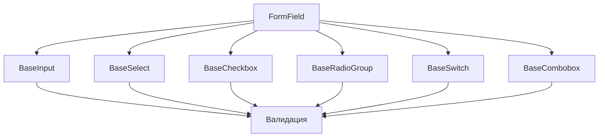

# Компоненты форм

Компоненты форм предназначены для сбора и валидации данных от пользователей. Все компоненты поддерживают v-model и имеют консистентный API.

## BaseInput

### Описание
Компонент текстового поля ввода с поддержкой различных типов и состояний.

### Props

| Название | Тип | По умолчанию | Обязательный | Описание |
|----------|-----|--------------|--------------|----------|
| modelValue | String | "" | Нет | Значение поля ввода |
| label | String | "" | Нет | Метка поля ввода |
| placeholder | String | "" | Нет | Текст-подсказка |
| type | String | "text" | Нет | Тип поля ввода (text, password, email, number, и т.д.) |
| disabled | Boolean | false | Нет | Отключает поле ввода |
| error | String | "" | Нет | Текст ошибки |
| required | Boolean | false | Нет | Указывает, что поле обязательно для заполнения |

### События

| Название | Полезная нагрузка | Описание |
|----------|-------------------|----------|
| update:modelValue | String | Срабатывает при изменении значения поля |
| focus | FocusEvent | Срабатывает при получении фокуса |
| blur | FocusEvent | Срабатывает при потере фокуса |
| input | Event | Срабатывает при вводе текста |

### Пример использования

```vue
<template>
  <BaseInput
    v-model="username"
    label="Имя пользователя"
    placeholder="Введите имя пользователя"
    :error="errors.username"
    required
  />
</template>

<script setup>
import { ref, computed } from 'vue';
import { BaseInput } from 'alt-ui';

const username = ref('');
const errors = ref({
  username: ''
});

function validate() {
  if (!username.value) {
    errors.value.username = 'Имя пользователя обязательно';
    return false;
  }
  errors.value.username = '';
  return true;
}
</script>
```

## BaseSelect

### Описание
Компонент выпадающего списка для выбора из предопределенных опций.

### Props

| Название | Тип | По умолчанию | Обязательный | Описание |
|----------|-----|--------------|--------------|----------|
| modelValue | String, Number | undefined | Нет | Текущее выбранное значение |
| options | Array | [] | Да | Массив опций для отображения |
| label | String | "" | Нет | Метка для селекта |
| placeholder | String | "" | Нет | Текст-подсказка, когда ничего не выбрано |
| disabled | Boolean | false | Нет | Отключает селект |

### События

| Название | Полезная нагрузка | Описание |
|----------|-------------------|----------|
| update:modelValue | String, Number | Срабатывает при изменении выбранного значения |
| change | String, Number | Срабатывает при изменении выбранного значения |

### Пример использования

```vue
<template>
  <BaseSelect
    v-model="selectedCountry"
    :options="countries"
    label="Страна"
    placeholder="Выберите страну"
  />
</template>

<script setup>
import { ref } from 'vue';
import { BaseSelect } from 'alt-ui';

const selectedCountry = ref('');
const countries = [
  { value: 'ru', label: 'Россия' },
  { value: 'us', label: 'США' },
  { value: 'de', label: 'Германия' }
];
</script>
```

## BaseCheckbox

### Описание
Компонент флажка (чекбокса) для выбора опций.

### Props

| Название | Тип | По умолчанию | Обязательный | Описание |
|----------|-----|--------------|--------------|----------|
| modelValue | Boolean | false | Нет | Текущее состояние чекбокса |
| label | String | "" | Нет | Текст, связанный с чекбоксом |
| disabled | Boolean | false | Нет | Отключает чекбокс |

### События

| Название | Полезная нагрузка | Описание |
|----------|-------------------|----------|
| update:modelValue | Boolean | Срабатывает при изменении состояния |

### Пример использования

```vue
<template>
  <BaseCheckbox v-model="agreeTerms" label="Я согласен с условиями использования" />
</template>

<script setup>
import { ref } from 'vue';
import { BaseCheckbox } from 'alt-ui';

const agreeTerms = ref(false);
</script>
```

## BaseRadioGroup

### Описание
Компонент группы радио-кнопок для выбора одного варианта из нескольких.

### Props

| Название | Тип | По умолчанию | Обязательный | Описание |
|----------|-----|--------------|--------------|----------|
| modelValue | String, Number | "" | Нет | Текущее выбранное значение |
| options | Array | [] | Да | Массив опций для отображения |
| name | String | "" | Нет | Имя группы радио-кнопок |
| disabled | Boolean | false | Нет | Отключает все радио-кнопки в группе |
| label | String | "" | Нет | Метка для группы |

### События

| Название | Полезная нагрузка | Описание |
|----------|-------------------|----------|
| update:modelValue | String, Number | Срабатывает при изменении выбранного значения |

### Пример использования

```vue
<template>
  <BaseRadioGroup
    v-model="selectedGender"
    :options="genderOptions"
    label="Пол"
    name="gender"
  />
</template>

<script setup>
import { ref } from 'vue';
import { BaseRadioGroup } from 'alt-ui';

const selectedGender = ref('');
const genderOptions = [
  { value: 'male', label: 'Мужской' },
  { value: 'female', label: 'Женский' },
  { value: 'other', label: 'Другой' }
];
</script>
```

## BaseSwitch

### Описание
Компонент переключателя для включения/выключения опций.

### Props

| Название | Тип | По умолчанию | Обязательный | Описание |
|----------|-----|--------------|--------------|----------|
| modelValue | Boolean | false | Нет | Текущее состояние переключателя |
| label | String | "" | Нет | Текст, связанный с переключателем |
| disabled | Boolean | false | Нет | Отключает переключатель |

### События

| Название | Полезная нагрузка | Описание |
|----------|-------------------|----------|
| update:modelValue | Boolean | Срабатывает при изменении состояния |

### Пример использования

```vue
<template>
  <BaseSwitch v-model="darkMode" label="Темная тема" />
</template>

<script setup>
import { ref } from 'vue';
import { BaseSwitch } from 'alt-ui';

const darkMode = ref(false);
</script>
```

## FormField

### Описание
Контейнер для компонентов формы, предоставляющий унифицированное отображение меток, сообщений об ошибках и подсказок.

### Props

| Название | Тип | По умолчанию | Обязательный | Описание |
|----------|-----|--------------|--------------|----------|
| label | String | "" | Нет | Метка поля |
| error | String | "" | Нет | Текст ошибки |
| hint | String | "" | Нет | Подсказка для поля |
| required | Boolean | false | Нет | Указывает, что поле обязательно для заполнения |

### Слоты

| Название | Данные скопа | Описание |
|----------|--------------|----------|
| default | - | Компонент формы |
| label | - | Кастомная метка |
| hint | - | Кастомная подсказка |
| error | - | Кастомное сообщение об ошибке |

### Пример использования

```vue
<template>
  <FormField
    label="Email"
    :error="errors.email"
    hint="Мы никогда не передадим вашу почту третьим лицам"
    required
  >
    <BaseInput v-model="email" type="email" placeholder="example@example.com" />
  </FormField>
</template>

<script setup>
import { ref } from 'vue';
import { FormField, BaseInput } from 'alt-ui';

const email = ref('');
const errors = ref({
  email: ''
});

function validateEmail() {
  // Логика валидации email
}
</script>
```

## Архитектура форм



<!-- id="form-components" caption="Архитектура форм" -->

## Компоненты

### FormField

Базовый компонент-обертка для всех элементов форм.

```vue
<FormField
  label="Имя пользователя"
  :error="errors.username"
  required
>
  <BaseInput v-model="username" />
</FormField>
```

#### API

| Prop | Тип | По умолчанию | Описание |
|------|-----|--------------|-----------|
| label | string | - | Метка поля |
| error | string | - | Текст ошибки |
| required | boolean | false | Обязательное поле |

### BaseInput

Текстовое поле ввода с поддержкой различных типов.

```vue
<BaseInput
  v-model="value"
  type="text"
  placeholder="Введите текст"
  :error="error"
/>
```

#### API

| Prop | Тип | По умолчанию | Описание |
|------|-----|--------------|-----------|
| modelValue | string | '' | Значение поля |
| type | 'text' \| 'password' \| 'email' \| 'number' | 'text' | Тип поля |
| placeholder | string | - | Подсказка |
| error | string | - | Текст ошибки |

### BaseSelect

Выпадающий список с поддержкой поиска.

```vue
<BaseSelect
  v-model="selected"
  :options="options"
  placeholder="Выберите опцию"
/>
```

#### API

| Prop | Тип | По умолчанию | Описание |
|------|-----|--------------|-----------|
| modelValue | any | null | Выбранное значение |
| options | Option[] | [] | Массив опций |
| searchable | boolean | false | Возможность поиска |

### BaseCheckbox

Чекбокс с поддержкой промежуточного состояния.

```vue
<BaseCheckbox
  v-model="checked"
  label="Согласен с условиями"
/>
```

#### API

| Prop | Тип | По умолчанию | Описание |
|------|-----|--------------|-----------|
| modelValue | boolean | false | Состояние |
| label | string | - | Текст метки |
| indeterminate | boolean | false | Промежуточное состояние |

### BaseRadioGroup

Группа радио-кнопок.

```vue
<BaseRadioGroup
  v-model="selected"
  :options="options"
  orientation="horizontal"
/>
```

#### API

| Prop | Тип | По умолчанию | Описание |
|------|-----|--------------|-----------|
| modelValue | any | null | Выбранное значение |
| options | Option[] | [] | Массив опций |
| orientation | 'horizontal' \| 'vertical' | 'vertical' | Ориентация |

### BaseSwitch

Переключатель.

```vue
<BaseSwitch
  v-model="enabled"
  label="Включить уведомления"
/>
```

#### API

| Prop | Тип | По умолчанию | Описание |
|------|-----|--------------|-----------|
| modelValue | boolean | false | Состояние |
| label | string | - | Текст метки |
| size | 'sm' \| 'md' \| 'lg' | 'md' | Размер |

### BaseCombobox

Комбинированное поле ввода с выпадающим списком и поддержкой автодополнения.

```vue
<BaseCombobox
  v-model="value"
  :options="options"
  :loading="isLoading"
  @search="handleSearch"
/>
```

#### API

| Prop | Тип | По умолчанию | Описание |
|------|-----|--------------|-----------|
| modelValue | any | null | Выбранное значение |
| options | Option[] | [] | Массив опций |
| loading | boolean | false | Состояние загрузки |
| multiple | boolean | false | Множественный выбор |

## Интеграция с форм-менеджерами

### Пример с VeeValidate

```vue
<script setup lang="ts">
import { useForm } from 'vee-validate'

const { handleSubmit, errors } = useForm({
  validationSchema: {
    username: 'required|min:3',
    email: 'required|email'
  }
})
</script>

<template>
  <form @submit="handleSubmit">
    <FormField
      label="Имя пользователя"
      :error="errors.username"
      required
    >
      <BaseInput
        v-model="username"
        name="username"
      />
    </FormField>
    
    <FormField
      label="Email"
      :error="errors.email"
      required
    >
      <BaseInput
        v-model="email"
        type="email"
        name="email"
      />
    </FormField>
  </form>
</template>
```

## Лучшие практики

1. **Группировка полей**
   ```vue
   <div class="form-group">
     <FormField>
       <BaseInput v-model="firstName" label="Имя" />
     </FormField>
     <FormField>
       <BaseInput v-model="lastName" label="Фамилия" />
     </FormField>
   </div>
   ```