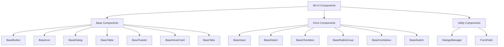

# Обзор компонентов Alt-UI

Alt-UI предоставляет набор высококачественных, типизированных и доступных компонентов для Vue 3. Все компоненты разработаны с учетом принципов современного UI/UX дизайна и оптимизированы для производительности.

## Архитектура компонентов



## Структура компонентов

Компоненты организованы в следующие категории:

### Базовые компоненты
- Фундаментальные блоки интерфейса
- Оптимизированы для повторного использования
- Независимы от бизнес-логики
- Расположены в `src/components/base`

### Компоненты форм
- Специализированные компоненты для работы с формами
- Поддержка валидации и состояний
- Совместимость с нативными элементами форм
- Расположены в `src/components/form`

### Утилитарные компоненты и хуки
- Дополнительные компоненты и хуки для расширенной функциональности
- Композиции (composables) для управления состоянием
- Расположены в отдельных директориях, например `src/components/dialogs`

## Принципы разработки

1. **Композиция**: Компоненты построены по принципу композиции для максимальной гибкости
2. **Доступность (a11y)**: Соответствие WAI-ARIA рекомендациям и полная поддержка клавиатурной навигации
3. **Полная типизация**: TypeScript используется для обеспечения типобезопасности API компонентов
4. **Консистентность**: Единообразное API через все компоненты
5. **Темизация**: Поддержка темной и светлой тем через CSS-переменные

## Использование компонентов

```vue
<script setup lang="ts">
import { BaseButton, BaseIcon } from 'alt-ui'

// Локальное состояние и логика
const handleClick = () => {
  // Обработка клика
}
</script>

<template>
  <BaseButton variant="primary" @click="handleClick">
    <BaseIcon name="check" />
    Подтвердить
  </BaseButton>
</template>
```

## Импорт стилей

Для работы компонентов необходимо импортировать основные стили:

```js
// В вашем main.js или main.ts
import 'alt-ui/styles'
```

## Tree-Shaking

Alt-UI оптимизирована для tree-shaking, что позволяет включать только используемые компоненты в финальный бандл.

## Экспорты компонентов

```ts
// Базовые компоненты
export { default as BaseButton } from "./components/base/BaseButton.vue";
export { default as BaseIcon } from "./components/base/BaseIcon.vue";
export { default as BaseDialog } from "./components/base/BaseDialog.vue";
export { default as BaseHoverCard } from "./components/base/BaseHoverCard.vue";
export { default as BaseMenu } from "./components/base/BaseMenu.vue";
export { default as BaseSpinner } from "./components/base/BaseSpinner.vue";
export { default as BaseTable } from "./components/base/BaseTable.vue";
export { default as BaseTabs } from "./components/base/BaseTabs.vue";
// ... и другие базовые компоненты

// Компоненты форм
export { default as BaseInput } from "./components/form/BaseInput.vue";
export { default as BaseCheckbox } from "./components/form/BaseCheckbox.vue";
export { default as BaseCombobox } from "./components/form/BaseCombobox.vue";
export { default as BaseRadioGroup } from "./components/form/BaseRadioGroup.vue";
export { default as BaseSelect } from "./components/form/BaseSelect.vue";
export { default as BaseSwitch } from "./components/form/BaseSwitch.vue";
export { default as FormField } from "./components/form/FormField.vue";
// ... и другие компоненты форм

// Утилиты
export { useDialogs } from "./components/dialogs/useDialogs";
export { loadIcons } from "./utils/icons";
export { toast, toaster } from "./utils/toaster";
// ... и другие утилиты
```

## Дополнительная информация

- [Базовые компоненты](/components/base-components) - Подробное описание базовых компонентов
- [Компоненты форм](/components/form-components) - Подробное описание компонентов форм
- [Паттерны использования](/components/patterns) - Рекомендуемые паттерны и примеры использования 