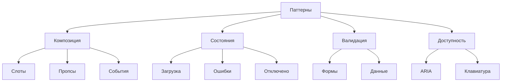

# Паттерны использования компонентов

В этом разделе описаны основные паттерны и рекомендации по использованию компонентов дизайн-системы Lissa Health.

## Архитектура паттернов



## Основные паттерны

### 1. Композиция компонентов

#### Слоты и пропсы

```vue
<BaseDialog>
  <template #header>
    <div class="dialog-header">
      <BaseIcon name="info" />
      <h2>{{ title }}</h2>
    </div>
  </template>
  
  <template #default>
    <div class="dialog-content">
      <slot />
    </div>
  </template>
  
  <template #footer>
    <div class="dialog-actions">
      <BaseButton @click="cancel">Отмена</BaseButton>
      <BaseButton variant="primary" @click="confirm">
        Подтвердить
      </BaseButton>
    </div>
  </template>
</BaseDialog>
```

### 2. Управление состояниями

#### Загрузка данных

```vue
<template>
  <div class="data-container">
    <BaseSpinner v-if="loading" />
    
    <template v-else-if="error">
      <BaseIcon name="error" />
      <p>{{ error.message }}</p>
      <BaseButton @click="retry">Повторить</BaseButton>
    </template>
    
    <template v-else>
      <BaseTable :data="items" />
    </template>
  </div>
</template>
```

### 3. Формы и валидация

#### Комплексная форма

```vue
<script setup lang="ts">
import { useForm } from 'vee-validate'
import { ref } from 'vue'

const { handleSubmit, errors } = useForm({
  validationSchema: {
    name: 'required',
    email: 'required|email',
    type: 'required'
  }
})

const loading = ref(false)
const types = [
  { label: 'Тип 1', value: 'type1' },
  { label: 'Тип 2', value: 'type2' }
]

const onSubmit = handleSubmit(async (values) => {
  loading.value = true
  try {
    await submitForm(values)
    toast.success('Форма отправлена')
  } catch {
    toast.error('Ошибка отправки')
  } finally {
    loading.value = false
  }
})
</script>

<template>
  <form class="form" @submit="onSubmit">
    <FormField
      label="Имя"
      :error="errors.name"
      required
    >
      <BaseInput
        v-model="name"
        placeholder="Введите имя"
      />
    </FormField>
    
    <FormField
      label="Email"
      :error="errors.email"
      required
    >
      <BaseInput
        v-model="email"
        type="email"
        placeholder="example@mail.com"
      />
    </FormField>
    
    <FormField
      label="Тип"
      :error="errors.type"
      required
    >
      <BaseSelect
        v-model="type"
        :options="types"
        placeholder="Выберите тип"
      />
    </FormField>
    
    <BaseButton
      type="submit"
      :loading="loading"
      variant="primary"
    >
      Отправить
    </BaseButton>
  </form>
</template>
```

### 4. Модальные окна

#### Подтверждение действия

```vue
<script setup lang="ts">
const showConfirm = ref(false)
const itemToDelete = ref(null)

const confirmDelete = (item) => {
  itemToDelete.value = item
  showConfirm.value = true
}

const handleConfirm = async () => {
  try {
    await deleteItem(itemToDelete.value)
    toast.success('Элемент удален')
    showConfirm.value = false
  } catch {
    toast.error('Ошибка удаления')
  }
}
</script>

<template>
  <div>
    <BaseButton @click="confirmDelete(item)">
      Удалить
    </BaseButton>
    
    <BaseDialog
      v-model="showConfirm"
      title="Подтверждение"
    >
      <p>Вы уверены, что хотите удалить этот элемент?</p>
      
      <template #footer>
        <BaseButton @click="showConfirm = false">
          Отмена
        </BaseButton>
        <BaseButton
          variant="danger"
          @click="handleConfirm"
        >
          Удалить
        </BaseButton>
      </template>
    </BaseDialog>
  </div>
</template>
```

### 5. Таблицы и списки

#### Таблица с фильтрацией и сортировкой

```vue
<script setup lang="ts">
const filters = ref({
  search: '',
  status: null
})

const sortConfig = ref({
  field: 'name',
  direction: 'asc'
})

const handleSort = (field) => {
  if (sortConfig.value.field === field) {
    sortConfig.value.direction = 
      sortConfig.value.direction === 'asc' ? 'desc' : 'asc'
  } else {
    sortConfig.value = { field, direction: 'asc' }
  }
}
</script>

<template>
  <div class="table-container">
    <div class="table-toolbar">
      <BaseInput
        v-model="filters.search"
        placeholder="Поиск..."
        icon="search"
      />
      
      <BaseSelect
        v-model="filters.status"
        :options="statusOptions"
        placeholder="Статус"
      />
    </div>
    
    <BaseTable
      :data="filteredData"
      :sort-config="sortConfig"
      @sort="handleSort"
    />
  </div>
</template>
```

## Рекомендации

1. **Композиция**
   - Используйте слоты для гибкой кастомизации
   - Разделяйте логику и представление
   - Следуйте принципу единой ответственности

2. **Состояния**
   - Всегда обрабатывайте все возможные состояния
   - Используйте загрузчики и сообщения об ошибках
   - Предусматривайте пустые состояния

3. **Доступность**
   - Используйте ARIA-атрибуты
   - Обеспечьте навигацию с клавиатуры
   - Следите за контрастностью

4. **Производительность**
   - Используйте ленивую загрузку
   - Оптимизируйте рендеринг списков
   - Избегайте излишней вложенности

5. **Типизация**
   - Определяйте интерфейсы для пропсов
   - Используйте строгую типизацию
   - Документируйте типы 