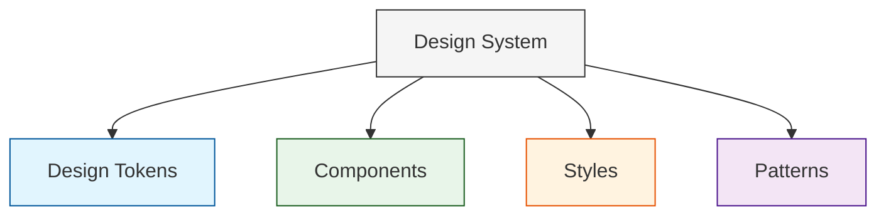
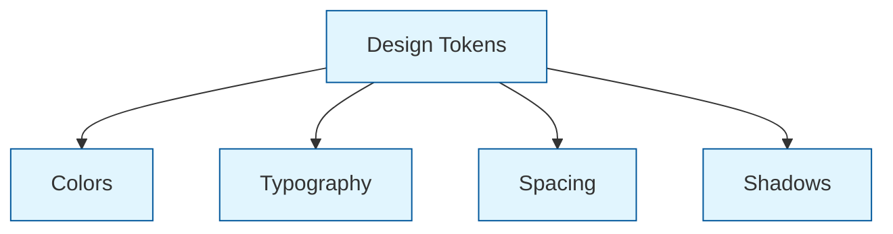
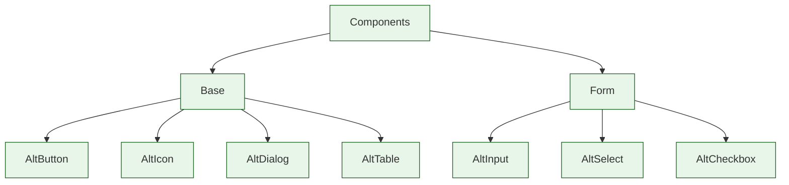
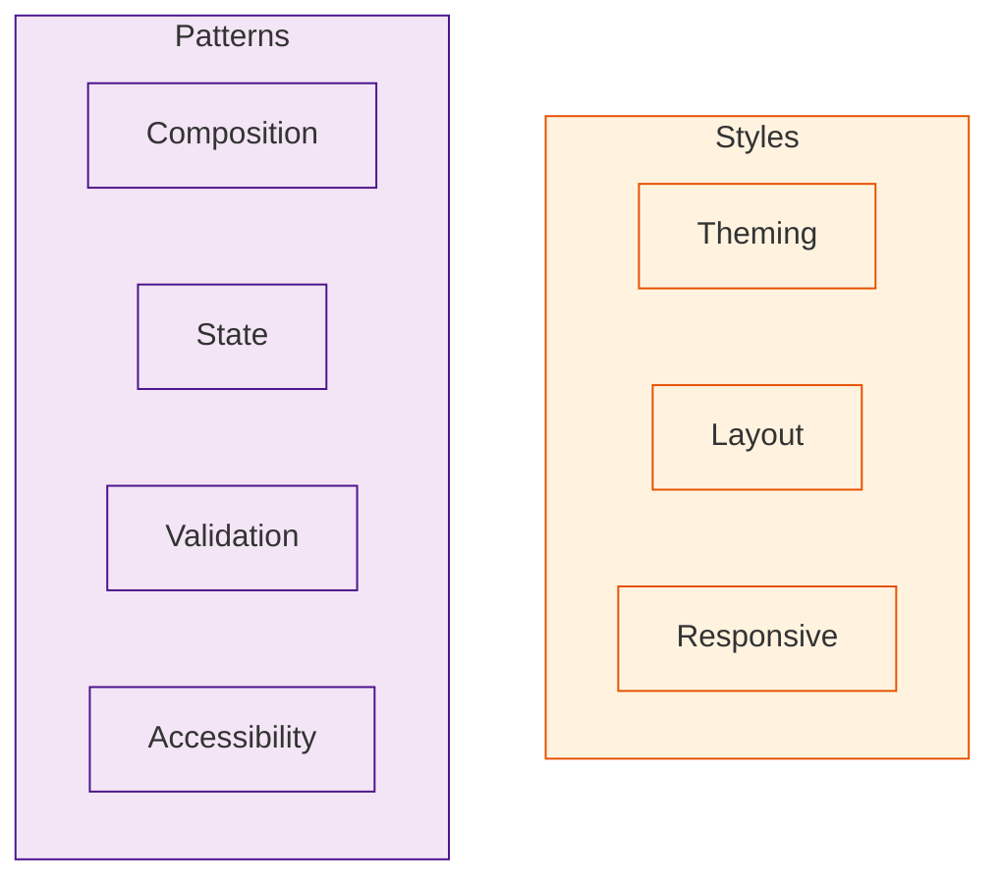

# Система дизайна

Наша система дизайна предоставляет последовательный и поддерживаемый подход к стилизации по всему приложению.

## Архитектура дизайн-системы

### Общая структура



<!-- diagram id="design-system-overview" caption="Общая структура дизайн-системы" -->

### Дизайн-токены



<!-- diagram id="design-tokens" caption="Структура дизайн-токенов" -->

### Компоненты



<!-- diagram id="components" caption="Структура компонентов" -->

### Стили и паттерны



<!-- diagram id="styles-patterns" caption="Стили и паттерны" -->

## Техническая документация

Техническая часть дизайн-системы описывает реализацию и практические аспекты использования стилей в приложении:

- [Структура стилей](./technical/style-structure.md) - организация файлов CSS, методология и лучшие практики
- [Система тем](./technical/themes.md) - управление темами, переключение между светлой и темной темой, а также миграция с alt-ui на theme переменные

### Рекомендации по использованию

- Всегда используйте переменные `--theme-*` вместо базовых дизайн-токенов `--alt-*`
- Следуйте единым принципам оформления компонентов
- Используйте композаблы для программного управления стилями

## Основные принципы

- Используйте пользовательские свойства CSS для токенов дизайна
- Следуйте семантическим соглашениям об именовании
- Поддерживайте адаптивный дизайн с помощью классов контрольных точек
- Держите стили модульными и многократно используемыми

## Дизайн-токены

### Типографика

```css
/* Семейство шрифтов */
--alt-font-family-base
--alt-font-family-heading
--alt-font-family-mono

/* Размер шрифта */
--alt-font-size-0  /* самый маленький */
--alt-font-size-6  /* самый большой */

/* Толщина шрифта */
--alt-font-weight-regular
--alt-font-weight-medium
--alt-font-weight-bold

/* Межстрочный интервал */
--alt-line-height-0  /* самый плотный */
--alt-line-height-4  /* самый свободный */
```

### Цвета

```css
/* Цвета текста */
--alt-c-text-1  /* основной */
--alt-c-text-2  /* вторичный */
--alt-c-text-3  /* третичный */

/* Цвета поверхности */
--alt-c-surface-1
--alt-c-surface-2
--alt-c-surface-3
--alt-c-surface-4
--alt-c-surface-5

/* Цвета бренда */
--alt-c-brand-1-{50-900}
--alt-c-brand-2-{50-900}
--alt-c-brand-3-{50-900}

/* Функциональные цвета */
--alt-c-success
--alt-c-warning
--alt-c-danger
--alt-c-info
```

### Отступы

```css
--alt-space-1   /* 0.25rem */
--alt-space-2   /* 0.5rem */
--alt-space-3   /* 0.75rem */
--alt-space-4   /* 1rem */
--alt-space-5   /* 1.25rem */
--alt-space-6   /* 1.5rem */
--alt-space-8   /* 2rem */
--alt-space-10  /* 2.5rem */
--alt-space-12  /* 3rem */
```

### Границы и тени

```css
/* Радиус границы */
--alt-radius-sm
--alt-radius-base
--alt-radius-md
--alt-radius-lg
--alt-radius-xl
--alt-radius-full

/* Тени */
--alt-shadow-1
--alt-shadow-2
--alt-shadow-3
--alt-shadow-4
--alt-shadow-5
```

## Адаптивный дизайн

Мы используем классы CSS на элементе `body` для применения адаптивных стилей:

- `.mobile` - Мобильные устройства
- `.tablet` - Планшеты
- `.notebook` - Ноутбуки
- `.desktop` - Настольные компьютеры

Пример использования:

```css
.my-component {
  padding: var(--alt-space-4);
}

body.mobile .my-component {
  padding: var(--alt-space-2);
}
```

## Лучшие практики

1. **Используйте токены дизайна**
   ```css
   /* ❌ Не делайте так */
   .element {
     color: #ff0000;
     margin: 16px;
   }

   /* ✅ Делайте так */
   .element {
     color: var(--alt-c-danger);
     margin: var(--alt-space-4);
   }
   ```

2. **Семантические имена классов**
   ```css
   /* ❌ Не делайте так */
   .red-box {
     background: var(--alt-c-danger);
   }

   /* ✅ Делайте так */
   .alert-container {
     background: var(--alt-c-danger);
   }
   ```

3. **CSS-Наследование**
   ```css
   /* ✅ Делайте так */
   .card {
     padding: var(--alt-space-4);

     &-header {
       margin-bottom: var(--alt-space-2);
     }

     &-content {
       color: var(--alt-c-text-2);
     }
   }
   ```

// Pure JavaScript equivalent of useHead({ title: () => t(route.meta.title) }):
```js
// Option 1: Simple title update
document.title = translateFunction(routeMeta.title);

// Update meta description
// Option 1: Update existing meta tag
let metaDescription = document.querySelector('meta[name="description"]');
if (metaDescription) {
  metaDescription.setAttribute('content', translateFunction(routeMeta.description));
} else {
  // Option 2: Create new meta tag if it doesn't exist
  metaDescription = document.createElement('meta');
  metaDescription.name = 'description';
  metaDescription.content = translateFunction(routeMeta.description);
  document.head.append(metaDescription);
}

// Option 2: With reactivity
function updateMetadata() {
  const observer = new MutationObserver(() => {
    document.title = translateFunction(routeMeta.title);
    
    let metaDescription = document.querySelector('meta[name="description"]');
    if (!metaDescription) {
      metaDescription = document.createElement('meta');
      metaDescription.name = 'description';
      document.head.append(metaDescription);
    }
    metaDescription.setAttribute('content', translateFunction(routeMeta.description));
  });
  
  observer.observe(document.body, { 
    subtree: true, 
    childList: true 
  });
  
  // Initial set
  document.title = translateFunction(routeMeta.title);
  let metaDescription = document.querySelector('meta[name="description"]');
  if (!metaDescription) {
    metaDescription = document.createElement('meta');
    metaDescription.name = 'description';
    document.head.append(metaDescription);
  }
  metaDescription.setAttribute('content', translateFunction(routeMeta.description));
  
  // Cleanup on route change
  return () => observer.disconnect();
}
```
