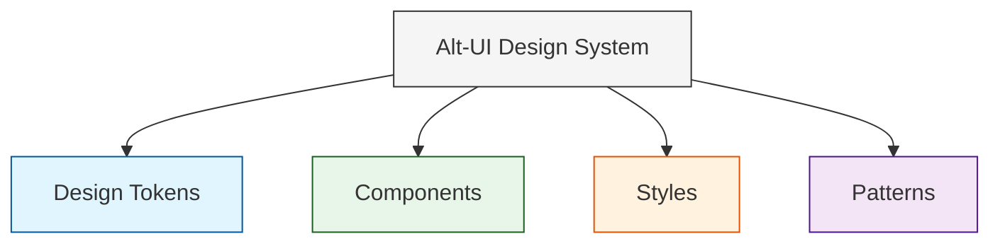
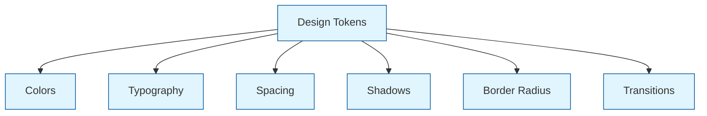
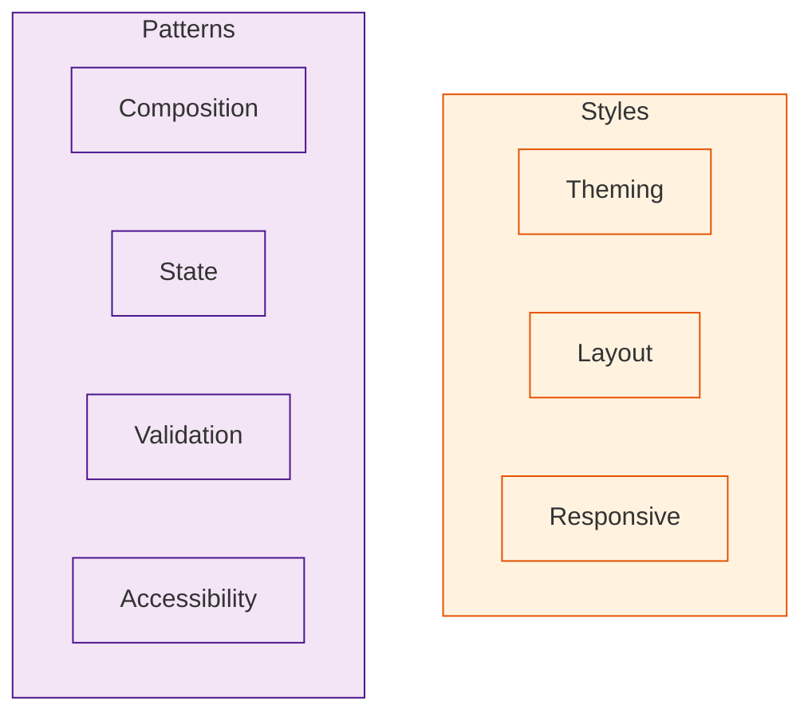

# Система дизайна Alt-UI

Alt-UI построена на принципах современных дизайн-систем, обеспечивая последовательный и масштабируемый подход к стилизации компонентов.

## Архитектура дизайн-системы

### Общая структура



### Дизайн-токены



### Компоненты

```mermaid
graph TD
    Components[Components]
    Base[Base]
    Form[Form]
    
    Components --> Base
    Components --> Form
    
    Base --> Button[BaseButton]
    Base --> Icon[BaseIcon]
    Base --> Dialog[BaseDialog]
    Base --> Table[BaseTable]
    Base --> Tabs[BaseTabs]
    Base --> HoverCard[BaseHoverCard]
    Base --> Menu[BaseMenu]
    Base --> Toaster[BaseToaster]
    
    Form --> Input[BaseInput]
    Form --> Select[BaseSelect]
    Form --> Checkbox[BaseCheckbox]
    Form --> RadioGroup[BaseRadioGroup]
    Form --> ComboBox[BaseCombobox]
    Form --> Switch[BaseSwitch]

    style Components fill:#e8f5e9,stroke:#1b5e20
    style Base fill:#e8f5e9,stroke:#1b5e20
    style Form fill:#e8f5e9,stroke:#1b5e20
    style Button fill:#e8f5e9,stroke:#1b5e20
    style Icon fill:#e8f5e9,stroke:#1b5e20
    style Dialog fill:#e8f5e9,stroke:#1b5e20
    style Table fill:#e8f5e9,stroke:#1b5e20
    style Tabs fill:#e8f5e9,stroke:#1b5e20
    style HoverCard fill:#e8f5e9,stroke:#1b5e20
    style Menu fill:#e8f5e9,stroke:#1b5e20
    style Toaster fill:#e8f5e9,stroke:#1b5e20
    style Input fill:#e8f5e9,stroke:#1b5e20
    style Select fill:#e8f5e9,stroke:#1b5e20
    style Checkbox fill:#e8f5e9,stroke:#1b5e20
    style RadioGroup fill:#e8f5e9,stroke:#1b5e20
    style ComboBox fill:#e8f5e9,stroke:#1b5e20
    style Switch fill:#e8f5e9,stroke:#1b5e20
```



### Стили и паттерны



## Основные принципы

- **Консистентность**: Используйте CSS переменные для унификации оформления
- **Семантика**: Следуйте семантическим соглашениям об именовании
- **Адаптивность**: Поддерживайте адаптивный дизайн для всех размеров экранов
- **Модульность**: Создавайте модульные и переиспользуемые компоненты
- **Доступность**: Обеспечивайте доступность для всех пользователей

## Дизайн-токены

Alt-UI использует систему токенов для обеспечения последовательности дизайна. Полный список токенов доступен в разделе [Дизайн-токены](/tokens/design-tokens).

### Типографика

```css
/* Семейство шрифтов */
--alt-font-family-base
--alt-font-family-heading
--alt-font-family-mono

/* Размер шрифта */
--alt-font-size-0  /* самый маленький */
--alt-font-size-6  /* самый большой */

/* Толщина шрифта */
--alt-font-weight-regular
--alt-font-weight-medium
--alt-font-weight-bold

/* Межстрочный интервал */
--alt-line-height-0  /* самый плотный */
--alt-line-height-4  /* самый свободный */
```

### Цвета

```css
/* Цвета текста */
--alt-c-text-1  /* основной */
--alt-c-text-2  /* вторичный */
--alt-c-text-3  /* третичный */

/* Цвета поверхности */
--alt-c-surface-1
--alt-c-surface-2
--alt-c-surface-3
--alt-c-surface-4
--alt-c-surface-5

/* Цвета бренда */
--alt-c-brand-1-{50-900}
--alt-c-brand-2-{50-900}
--alt-c-brand-3-{50-900}

/* Функциональные цвета */
--alt-c-success
--alt-c-warning
--alt-c-danger
--alt-c-info
```

### Отступы

```css
--alt-space-1   /* 0.25rem */
--alt-space-2   /* 0.5rem */
--alt-space-3   /* 0.75rem */
--alt-space-4   /* 1rem */
--alt-space-5   /* 1.25rem */
--alt-space-6   /* 1.5rem */
--alt-space-8   /* 2rem */
--alt-space-10  /* 2.5rem */
--alt-space-12  /* 3rem */
```

### Границы и тени

```css
/* Радиус границы */
--alt-radius-sm
--alt-radius-base
--alt-radius-md
--alt-radius-lg
--alt-radius-xl
--alt-radius-full

/* Тени */
--alt-shadow-1
--alt-shadow-2
--alt-shadow-3
--alt-shadow-4
--alt-shadow-5
```

## Адаптивный дизайн

Alt-UI поддерживает адаптивность через классы CSS на элементе `body`:

- `.mobile` - Мобильные устройства
- `.tablet` - Планшеты
- `.notebook` - Ноутбуки
- `.desktop` - Настольные компьютеры

Пример использования:

```css
.my-component {
  padding: var(--alt-space-4);
}

body.mobile .my-component {
  padding: var(--alt-space-2);
}
```

## Лучшие практики

1. **Используйте токены дизайна**
   ```css
   /* ❌ Не делайте так */
   .element {
     color: #ff0000;
     margin: 16px;
   }

   /* ✅ Делайте так */
   .element {
     color: var(--alt-c-danger);
     margin: var(--alt-space-4);
   }
   ```

2. **Семантические имена классов**
   ```css
   /* ❌ Не делайте так */
   .blue-button {
     background-color: var(--alt-c-brand-1-500);
   }

   /* ✅ Делайте так */
   .primary-button {
     background-color: var(--alt-c-brand-1-500);
   }
   ```

3. **Используйте CSS nesting для организации стилей**
   ```css
   .component {
     display: flex;
     
     &__header {
       font-weight: var(--alt-font-weight-bold);
     }
     
     &__content {
       padding: var(--alt-space-4);
     }
   }
   ```

4. **Адаптивные стили через классы, а не медиа-запросы**
   ```css
   /* ❌ Не делайте так */
   @media (max-width: 768px) {
     .component {
       font-size: var(--alt-font-size-0);
     }
   }

   /* ✅ Делайте так */
   body.mobile .component {
     font-size: var(--alt-font-size-0);
   }
   ```

## Темы

Alt-UI поддерживает светлую и темную темы через CSS переменные. Подробнее в разделе [Темы](/technical/themes).

## Примеры использования

Компоненты Alt-UI спроектированы для гибкости и повторного использования:

```vue
<template>
  <BaseButton variant="primary" size="lg">
    Большая кнопка
  </BaseButton>
  
  <BaseInput 
    v-model="username" 
    placeholder="Имя пользователя"
    :validation="usernameValidation" 
  />
</template>
```

Подробные примеры использования см. в разделе [Паттерны](/components/patterns). 